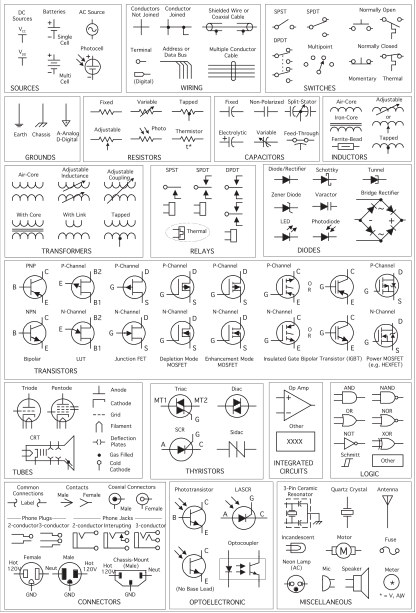
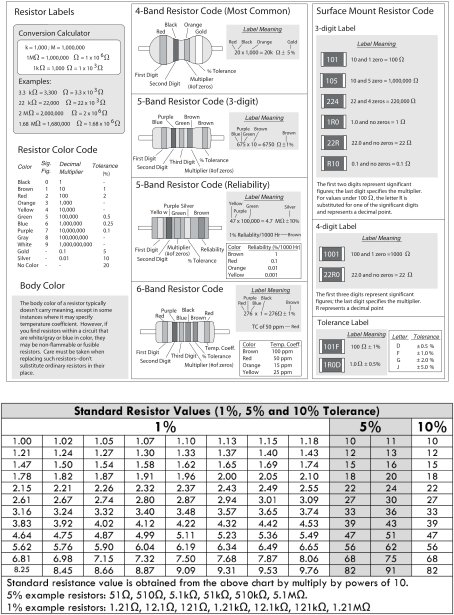
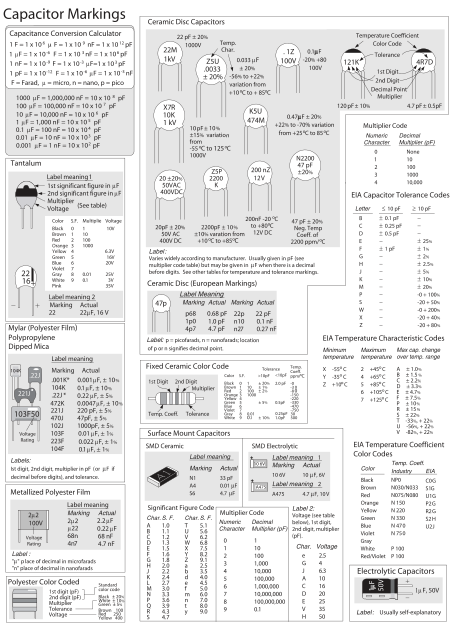

Këtu do gjeni të gjitha Jupyter notbook me simulimet dhe praktikat!

Më poshtë gjeni info mbi simbolet bazike më të përdorura, llojet e rezistencave dhe kondensatorëve.

# Të gjitha komponentet bazike në elektronike

# Rezitencat bazike

# Kondensatorët bazike

