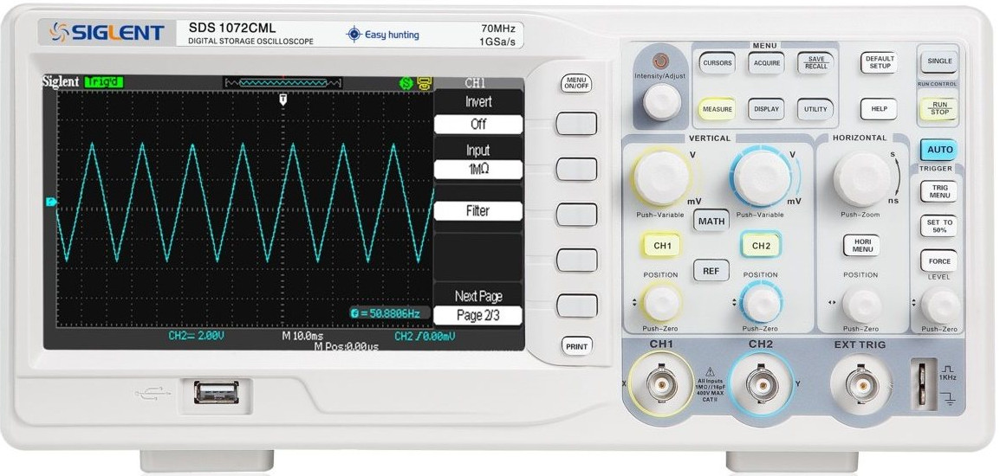
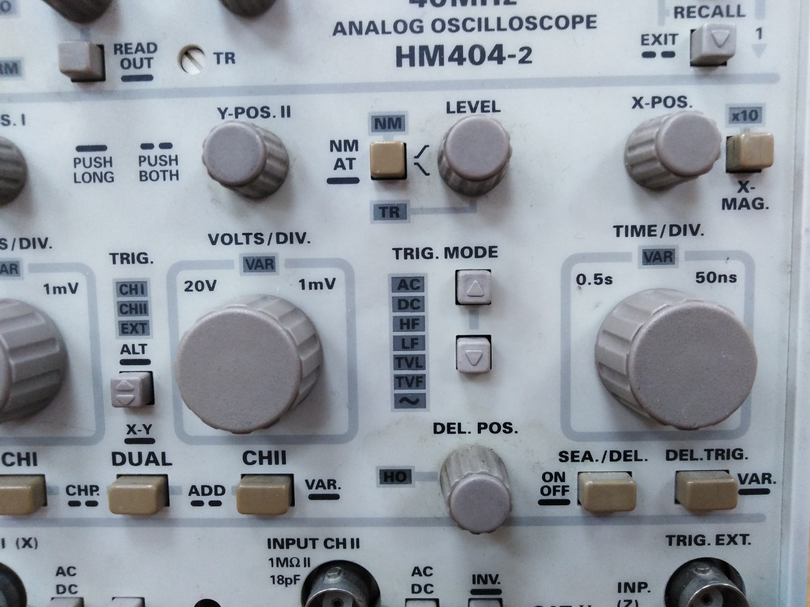

# **Oshiloskopi**

## 1. Çfarë është oshiloskopi?

Osciloskopi është një pajisje elektronike matëse, e cila merr sinjalin elektrik në hyrje (p.sh. një tension) dhe e paraqet atë në formë grafike në ekran. Kjo u mundëson inxhinierëve, fizikantëve dhe studentëve të kuptojnë përbërjet kohore të sinjalit në mënyrë të drejtpërdrejtë.  
- **Zbatimi**: Përdoret për matjen e fenomeneve transiente, sinjaleve periodike (si sinusoida, katrore, trekëndore) apo fenomeneve komplekse (si pulsime të shkurtra, sinjale dixhitale, modulime etj.).  
- **Pse është i rëndësishëm**: Na jep një pamje “live” të ndryshimeve dinamike të tensionit dhe sjelljes së qarkut.

---

## 2. Parimi themelor i funksionimit

### 2.1. Marrja e sinjalit dhe amplifikimi
Një sondë (probe) merr sinjalin elektrik nga qarku që dëshirojmë të studiojmë. Ky sinjal kalon nëpër amplifikatorë të brendshëm për t’u rregulluar në një nivel të përshtatshëm, në mënyrë që të mund të shfaqet në ekran pa u humbur detajet.

### 2.2. Konvertimi në formë dixhitale (te osciloskopët modernë)
Shumica e osciloskopëve bashkëkohorë janë me bazë dixhitale (DSO – Digital Storage Oscilloscope). Sinjali, pas amplifikimit, kthehet në formë numerike përmes një konvertuesi ADC (Analog-to-Digital Converter), dhe pastaj përpunohet nga procesorë të brendshëm.

### 2.3. Ekranizimi i sinjalit
- **Në osciloskopët analogë**: Një tub katodik (CRT) ndryshon pozicionin e rrezes së elektroneve në funksion të tensionit. Kjo “rreze” e elektroneve lëviz majtas-djathtas sipas kohës (skanimi horizontal) dhe lart-poshtë sipas nivelit të sinjalit (skanimi vertikal).
- **Në osciloskopët dixhitalë**: Ekrani (qoftë LCD, LED apo tjetër) përditësohet me pikselë në bazë të vlerave dixhitale të sinjalit, duke ndërtuar një grafik tension-kohë.

### 2.4. Sistemi i trigërimit (trigger)
Ky sistem “orvat” se kur duhet të fillojë të kapë një sinjal, që forma valore të mos “lëvizë” në ekran në mënyrë kaotike. Kështu, ekrani paraqet valën gjithmonë duke filluar nga një pikë e përcaktuar (p.sh., një nivel i caktuar tensioni ose një ndryshim i caktuar nga pozitive në negative).

---

## 3. Si ta përdorim në praktikë?

### 3.1. Vendosja e sondës
1. **Zgjidhni shkallën (volt/div) në kanalin e duhur**: Në fillim rregulloni ndjeshmërinë (sensitivitetin vertikal) në një vlerë që ju lejon të shihni sinjalin pa e “prerë” atë.
2. **Lidhni sondën (probe)**: Njëri skaj në hyrjen e osciloskopit (CH1, CH2, etj.), ndërsa tjetri në pikën e sinjalit që dëshironi të matni.  
   - Mbani mend ta lidhni me referencën e tokëzimit (ground) për të shmangur gabimet.  
   - Kontrolloni se sonda ka një shkallë 1x ose 10x, që ndikon te amplitude e sinjalit.

### 3.2. Rregullimi i bazës së kohës (time/div)
- Përshtatni shkallën e kohës me frekuencën e sinjalit tuaj. Nëse sinjali është me frekuencë të lartë, duhet një bazë kohe më e vogël (p.sh. mikrosekonda/div); nëse është frekuencë e ulët, mund të përdorni milisekonda ose sekonda/div.

### 3.3. Zgjedhja e mënyrës së trigërimit
- **Auto**: E lehtë për përdorim; osciloskopi fillon matjen vetë edhe pa sinjal.  
- **Normal**: Është i nevojshëm një nivel i caktuar i sinjalit për ta “startuar” shfaqjen.  
- **Single**: Kap vetëm një herë sinjalin dhe më pas e “ngrin” në ekran, p.sh. për fenomene transiente.

### 3.4. Leximi i rezultateve
- **Amplituda (volt)**: Masni me ndihmën e rrjetës ose me funksionet automatike të matjes.  
- **Periudha dhe frekuenca**: Një ndarje horizontale (time/div) tregon sa kohë i korrespondon një blloku në ekran. Duke numëruar ndarjet e një periudhe, shumëzoni me vlerën e time/div për të gjetur periudhën T, pastaj frekuenca f=1/T.  
- **Faza, DC offset, forma valore**: Mund të vëzhgohen direkt nga trajtimi i sinjalit në ekran.

---

## 4. Shembuj praktikë dhe demonstrime

1. **Matja e një sinusoide**: Merrni një gjenerator sinjalesh që prodhon një valë sinusoidale 1 kHz, p.sh. 1 Vp-p (volt kulm-kulm). Lidhni sondën në daljen e gjeneratorit:  
   - Rregulloni vertikalen në ~0.5 V/div.  
   - Rregulloni horizontalen në ~0.2 ms/div (1 kHz = periodë 1 ms).  
   - Do të shihni 5 ndarje vertikale (2.5 div) në kulm-kulm dhe 5 ndarje horizontale për një periudhë.

2. **Studimi i fenomeneve transiente**: Me një qark RC, mund të shihni si ngarkohet apo shkarkohet kondensatori kur ndryshoni papritur tensionin. Mund të masni kohën e ngarkimit dhe ta krahasoni me teorinë τ=RC.

3. **Simulim online**: Në platformat si Tinkercad Circuits ose software si LTspice apo Multisim, mund të “simuloni” një osciloskop virtual. Kjo ju lejon të krijoni qarqe në kompjuter dhe të shihni formën valore para se t’i ndërtoni fizikisht.

---

## 5. Këshilla dhe kujdes

- **Mos e tejkaloni vlerën maksimale të hyrjes**: Shumica e osciloskopëve kanë limite, p.sh. 300 V piku (në sonda 10x). Kapërcimi i këtyre mund ta dëmtojë pajisjen.  
- **Zemërimi (Grounding)**: Në osciloskopët që lidhen në rrjetin elektrik, pika e masës shpesh është e lidhur me tokën e rrjetit. Duhet pasur kujdes me qarqet “floating” ose me tensione të larta që mund të jenë në nivele të ndryshme potencialesh.  
- **Mos harroni rezolucionin**: Në osciloskopët dixhitalë, rezolucioni i ADC (zakonisht 8 bit ose 10 bit) ndikon në saktësinë e matjes.

---

### Në përfundim
Një osciloskop është mjeti kryesor për “pamje” të drejtpërdrejtë të sinjalit elektrik në elektronikë e fizikë. Ai shndërron tensionin në një grafik në funksion të kohës, duke mundësuar analizë të formave valore, amplitudës, frekuencës dhe fenomeneve dinamike e transiente. Mësimi i përdorimit të tij është thelbësor për këdo që merret me eksperimente elektronike, laboratorë fizikë apo projektim qarqesh.

Punoni me demonstrime praktike dhe simulime virtuale për të fituar intuitë se si funksionon osciloskopi dhe si t’i interpretoni rezultatet e tij në mënyrë saktë. 
