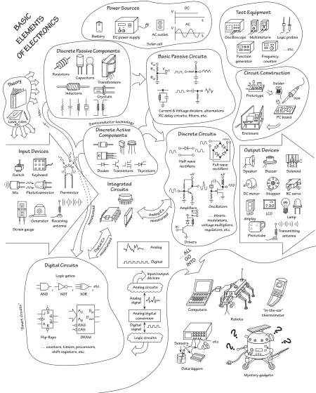

# Leksionet e Elektronikes
Elektronika viti 3...
në zhvillim ...

### Përmbajtja e këtij kursi në formë grafike

Figura e marrë nga libri: **"Practical Electronics for Inventors"**, Scherz & Monk, fourth edition, 2016
